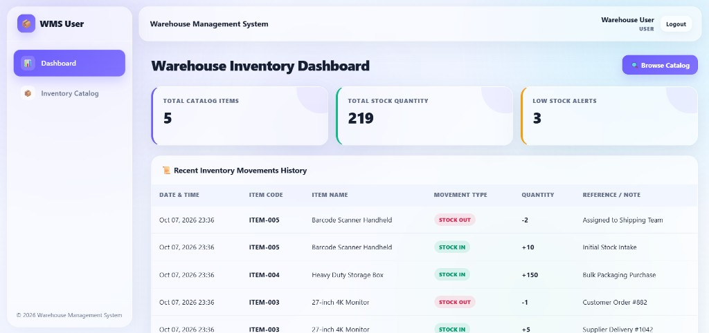
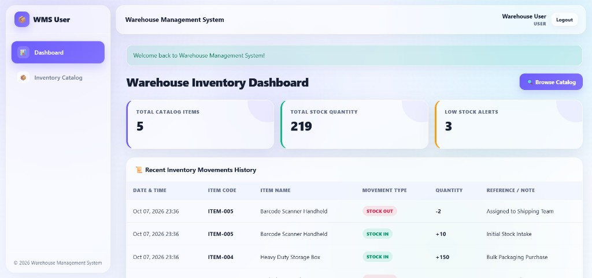

# Warehouse Management System

Two-role warehouse inventory app: admins manage stock, users browse the catalog. Built with PHP 8+, MySQL, and PDO (no framework).

## Quick start (XAMPP)
1. Place this folder in your XAMPP `htdocs` directory, for example `htdocs/project/warehouse_management_system`
2. Start **Apache** and **MySQL** in XAMPP
3. Import `database/schema.sql` in phpMyAdmin. This creates the `warehouse_management` database and the sample data
4. Copy `config/local.example.php` to `config/local.php`, then set your database host, name, user, and password in `local.php` only. A typical XAMPP setup uses host `localhost`, database `warehouse_management`, and user `root`
5. Open http://localhost/project/warehouse_management_system/
6. Sign in with a sample account from the table below
7. As admin, open **Item Inventory** to add an item, or **Stock Movements** to record stock IN / OUT
8. As a warehouse user, you can view the catalog and item details only

There is no public registration and no forgot-password page. An administrator can reset another user's password in **User Management**.

## Features
- Admin and warehouse-user login
- Add, edit, and delete inventory items (code, name, category, location, unit, quantity, reorder level)
- Stock IN and stock OUT with a reference note and the user who recorded it
- Dashboard totals: item count, stock quantity, low-stock count, and today's IN and OUT
- Low-stock highlight when quantity is at or below the reorder level
- Movement history with item, type, and date filters
- Printable movement reports with IN, OUT, and net totals
- Search and category filter on the item list and the read-only catalog
- Item detail page with that item's movement log
- Admin user management: create accounts, change role, reset password, deactivate, or delete
- JSON item search at `api/items.php` (login required)

## Screenshots

| User dashboard | After login |
|:---:|:---:|
|  |  |

## Folder structure
```
warehouse_management_system/
├── admin/                 Admin pages (dashboard, items, movements, reports, users)
├── user/                  Read-only catalog, dashboard, item details
├── api/items.php          Logged-in JSON item search
├── assets/css & js        Layout, filters, and form helpers
├── config/                App settings. Real database password goes in local.php (gitignored)
├── database/schema.sql    MySQL tables and sample data
├── docs/screenshots/      Interface screenshots
├── includes/              Auth, CSRF, layout, helpers
├── index.php              Sends you to the right dashboard or login
├── login.php
├── logout.php
└── LICENSE
```

## 1. XAMPP setup
1. Copy this folder under your XAMPP `htdocs` directory
2. Start **Apache** and **MySQL**
3. Open phpMyAdmin at http://localhost/phpmyadmin
4. Import `database/schema.sql`
5. Copy `config/local.example.php` to `config/local.php` and set the database host to `localhost`, plus your database name, user, and password
6. Open http://localhost/project/warehouse_management_system/

`config/config.php` is safe to publish. It loads `config/local.php` when that file exists, and otherwise uses an empty password. `config/local.php` is listed in `.gitignore`.

Command-line import:

```bash
mysql -u root -p < database/schema.sql
```

PHP extensions used: `pdo_mysql`, `session`, `openssl`, `mbstring`.

To start over: drop the `warehouse_management` database in phpMyAdmin, then import `database/schema.sql` again.

## 2. Sample accounts
These accounts are inserted by `database/schema.sql`. Change them after the first login.

| Role | Username | Password | Access |
| :--- | :--- | :--- | :--- |
| Administrator | `admin` | `admin123` | Items, stock IN/OUT, reports, users |
| Warehouse user | `demo` | `user123` | Catalog and item history |

Login: http://localhost/project/warehouse_management_system/login.php

An admin opens the admin dashboard. A warehouse user opens the user dashboard.

## 3. Add items and move stock
In **Item Inventory**, add an item with a code, name, category, location, unit, opening quantity, and reorder level. You can generate an item code from the form.

Creating an item with a quantity above zero also writes an opening **IN** movement.

In **Stock Movements**:
- Choose the item
- Choose **IN** (receive) or **OUT** (issue)
- Enter a quantity greater than zero and an optional reference note

The app enforces these rules:
- A saved movement shows the new on-hand quantity
- An **OUT** larger than current stock is rejected, and the quantity stays the same
- An item that already has movements cannot be deleted
- A user who already recorded movements cannot be deleted; deactivate that account instead
- You cannot delete the account you are logged in with

Low stock means `quantity` is less than or equal to `reorder_level`. Those rows appear on the admin dashboard.

## 4. Reports
Open **Reports & Analytics**.
Filter by item, category, IN or OUT, and a date range, then click **Generate**.
The page shows total IN, total OUT, and net movement.
**Print Report** uses the browser print dialog. The filter bar is hidden on the printed page.

Warehouse users do not see this page. They can open an item and read its movement list.

## 5. User accounts
Only an administrator can create logins.

In **User Management**:
- Set full name, username, role (`admin` or `user`), and a password of at least 6 characters
- Leave the password blank when editing if it should stay the same
- Clear **Active** to block login without deleting the account

Five failed passwords for the same username lock that login for 5 minutes.

## 6. Item API
`api/items.php` returns JSON for a logged-in session.

http://localhost/project/warehouse_management_system/api/items.php?search=mouse&category=Electronics

- `search` matches item code, name, or location
- `category` must match the category name exactly
- The response contains at most 100 rows
- A request without a login session returns HTTP 401

## System flow
1. A visitor is sent to the login page, or to their dashboard if they are already signed in
2. An admin adds items and records stock IN / OUT
3. Each movement runs in one database transaction: lock the item row, check the quantity, insert the log, then update stock
4. The dashboard, movement history, reports, and user catalog read those tables
5. Low-stock rows appear when quantity is at or below the reorder level

## Security notes
- Roles are `admin` and `user` only
- Admin pages require the admin role. A warehouse user is sent back to the user dashboard
- Passwords are stored with `password_hash()` and checked with `password_verify()`
- Forms that change data include a CSRF token
- Queries use PDO prepared statements
- Page output is escaped
- The session cookie is `HttpOnly` and `SameSite=Lax`. The session id is regenerated on login
- Direct access to `config/` and `database/` is blocked by `.htaccess`
- Put the real database password only in `config/local.php`. That file is gitignored and must not be published

## License

This project is licensed under the [MIT License](LICENSE).
